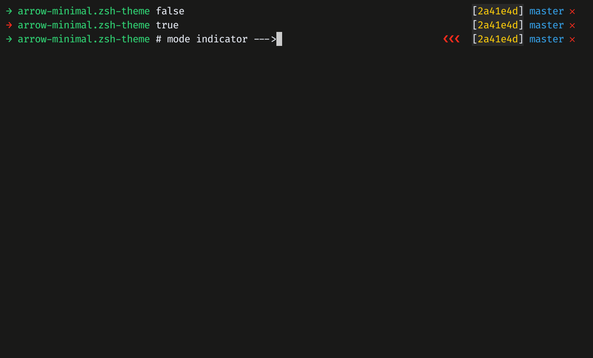

# ARROW-MINIMAL
A minimal zsh theme.

# Screencast
TODO: [asciicast.org](https://asciicast.org/)

## Installation
1. Copy file `arrow-minimal.zsh-theme` to `$ZSH_CUSTOM/themes` folder.
(You may need to create `themes` folder if it doesn't exist)

2. Set theme to `arrow-minimal` in `~/.zshrc`:
```
ZSH_THEME="arrow-minimal"
```

## Screenshot


## Features
* Current working directory
* Git sha 
* Git branch
* Git status
    * `𐄂` – Dirty branch
    * `✓` – Clean branch
    * `↓` – Behind remote
    * `↑` – Ahead remote
    * `↔` – Diverged remote
* Prompt indicator `→` turns red if the last run fails
* Vi-mode red indicator `❮❮❮`

## Notice
It would be better to put theme file into the `$ZSH_CUSTOM` folder, instead of
`~/.oh-my-zsh/themes`.
Because files under `~/.oh-my-zsh/custom/` folder are ignored by git, and will
leave the working directory clean.

You can get more help from oh-my-zsh:
[Custom Theme](https://github.com/robbyrussell/oh-my-zsh/wiki/Customization#overriding-and-adding-themes)

## License
The MIT License.
